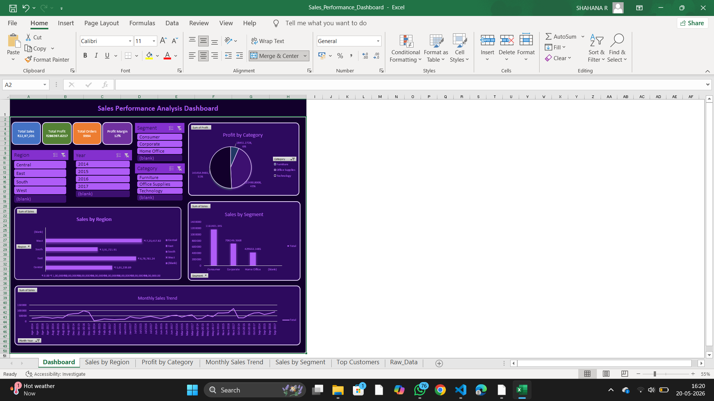
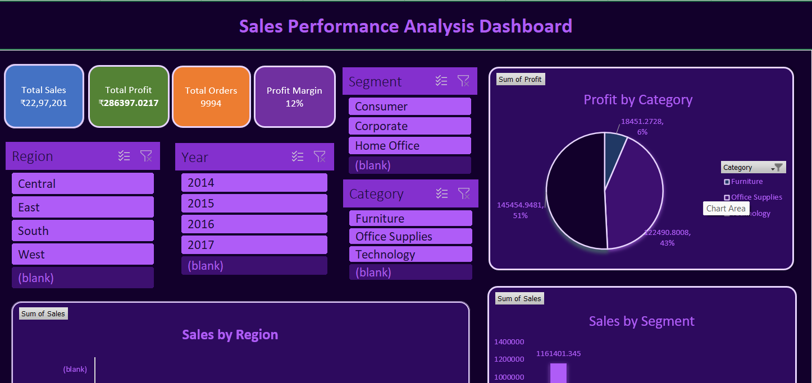
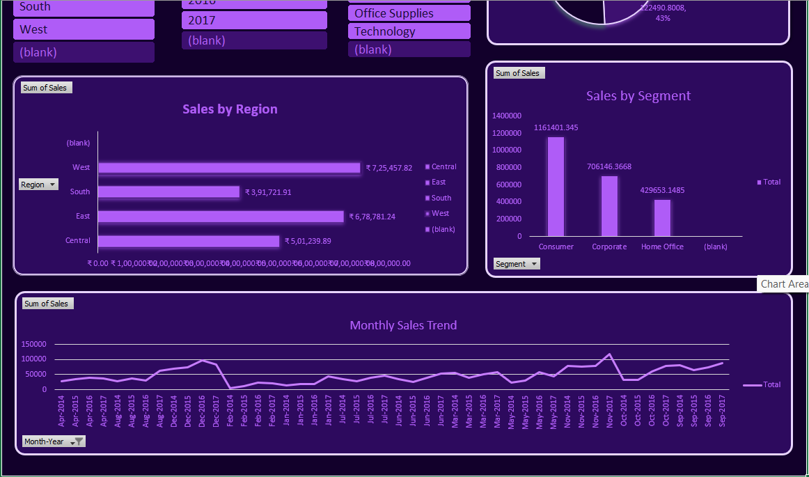

# Sales Performance Analysis Dashboard

## Project Overview
An interactive Excel dashboard developed to analyze sales performance, profit trends, regional growth, and customer insights.

## Features
- KPI Cards
- Pivot Tables
- Interactive Slicers
- Dynamic Charts
- Business Insights

## Tools Used
- Microsoft Excel
- Pivot Tables
- Pivot Charts
- Conditional Formatting

## Dashboard Preview

## 

## 

##  

## Author
Shahana R
